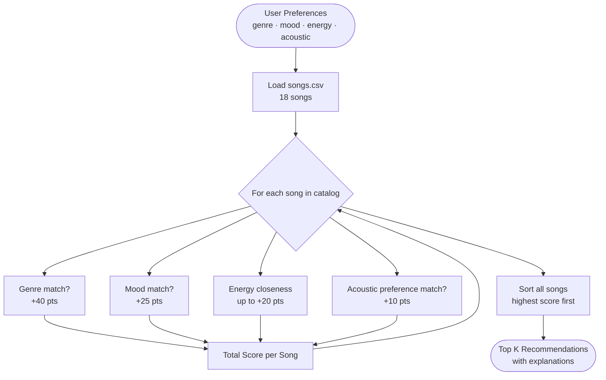

# Music Recommender Simulation

## Project Summary

In this project, I built a small music recommender that simulates how a simple content-based recommendation system works. The program reads song data from a CSV file, compares each song to a user's taste profile, and ranks songs based on how well they match the user's preferences. My version focuses on genre, mood, energy, and acousticness to generate recommendations and explain why each result was chosen.

---

## Data Flow



---

## How The System Works

Real-world recommendation systems often combine collaborative filtering and content-based filtering. Collaborative filtering uses the behavior of many users, such as likes, skips, playlists, and replay history, to find patterns. Content-based filtering focuses on the features of the item itself, such as genre, mood, energy, or tempo. This project uses a content-based approach because it is easier to understand and fits the small classroom dataset.

In my simulation, each `Song` stores the song's title, artist, genre, mood, energy, tempo, valence, danceability, and acousticness. The `UserProfile` stores a favorite genre, favorite mood, target energy, and whether the user prefers acoustic songs. The recommender computes a weighted score for every song. A matching genre is worth the most points, a matching mood is worth the next most, and songs get additional points when their energy is close to the user's target energy. The system also gives a smaller bonus when the song matches the user's acoustic preference. After scoring all songs, it sorts them from highest to lowest score and returns the top recommendations.

---

## Getting Started

### Setup

1. Create a virtual environment (optional but recommended):

```bash
python -m venv .venv
source .venv/bin/activate      # Mac or Linux
.venv\Scripts\activate         # Windows
```

2. Install dependencies

```bash
pip install -r requirements.txt
```

3. Run the app:

```bash
python -m src.main
```

### Running Tests

Run the tests with:

```bash
pytest
```

---

## Experiments You Tried

I tested the system with a pop, happy, high-energy profile and saw that songs like **Sunrise City** and **Rooftop Lights** ranked near the top, which matched my expectations. I also thought about how a lofi, chill, acoustic listener would likely prefer songs such as **Library Rain** and **Midnight Coding**, because those tracks are lower energy and more acoustic.

I considered changing the weights to make mood or acousticness matter more, but I kept genre as the strongest feature because genre is usually the broadest signal of user taste. If I lowered the genre weight too much, the system could start ranking songs with the right energy but the wrong style too high.

---

## Limitations and Risks

This recommender only works on a very small catalog, so it cannot represent the full range of musical taste. It also does not understand lyrics, language, artist popularity, listening history, or changing preferences over time. Because the score is based on a few fixed rules, it may over-favor one genre or mood and miss songs that are good recommendations for more subtle reasons.

Another limitation is that this system assumes user taste can be captured in a few simple fields. Real people often like multiple genres depending on the moment, activity, or context. A real product would also need to avoid creating narrow filter bubbles where users keep seeing the same type of content over and over.

---

## Reflection

This project helped me understand how recommendation systems turn input data into predictions. Even a simple system can feel useful when the features and weights make sense. I also learned that small design choices, like how many points to give a genre match, can strongly affect which songs get recommended.

It also made me think more about bias and unfairness in recommender systems. If the dataset is small or unbalanced, the system may unfairly favor certain genres, moods, or listening styles. In real apps, this could limit what users discover and reinforce narrow patterns instead of giving a healthy mix of recommendations.

See the full model card here: [model_card.md](model_card.md)
